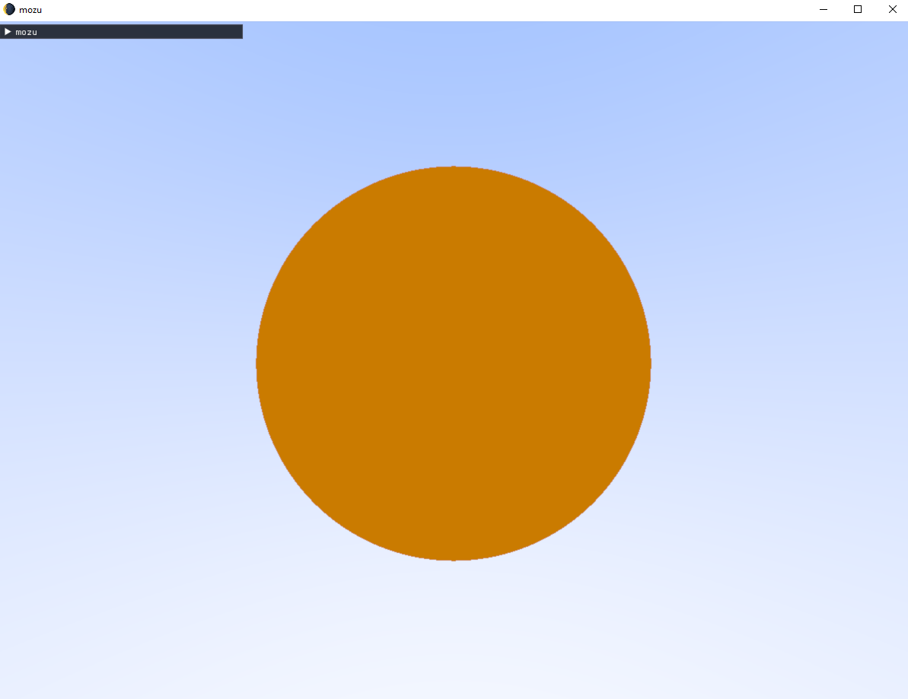
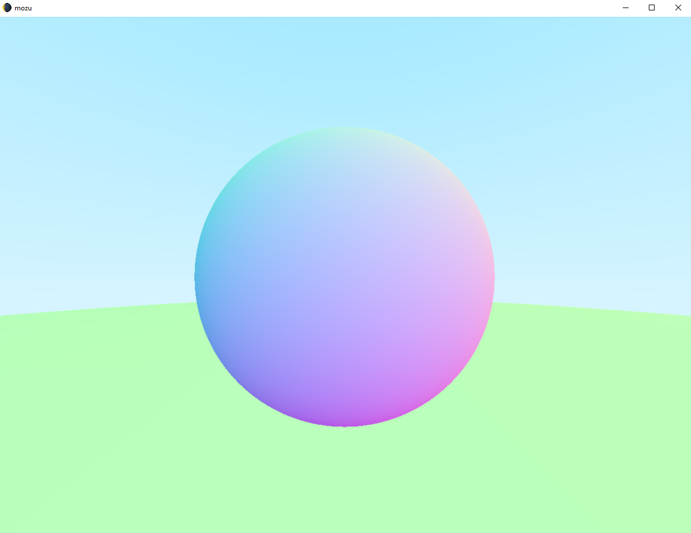
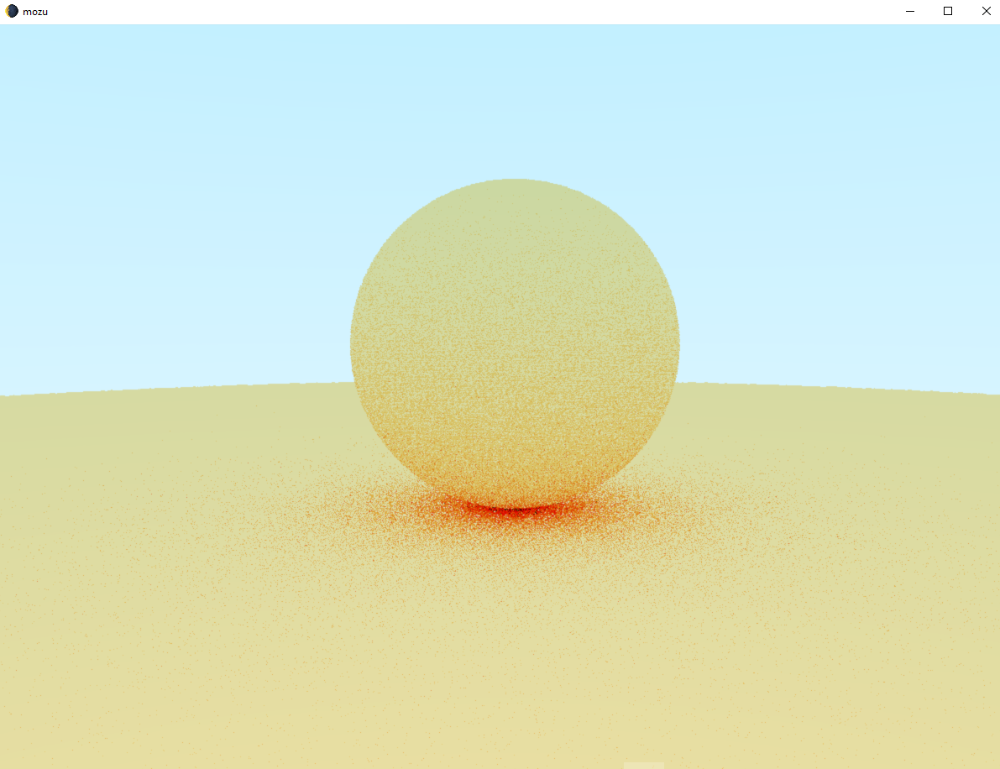
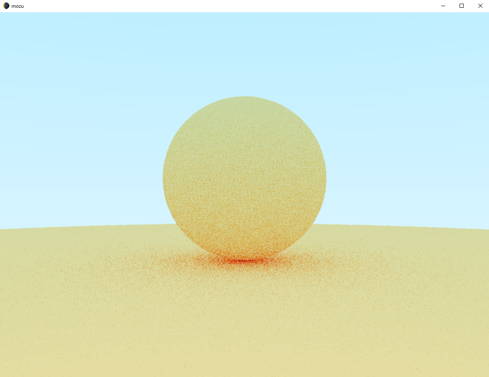
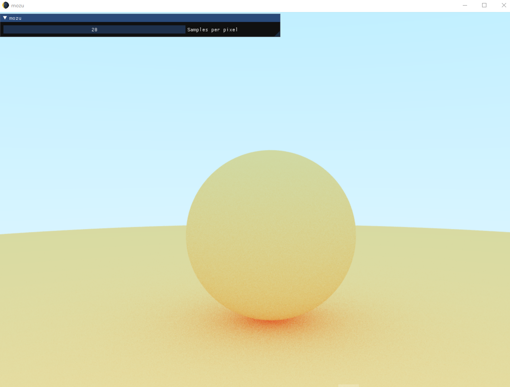

## 🏄🌒 mozu

OpenGL ray tracer based on the "Ray Tracing in One Weekend series".

### 📷Progress:

#### Sky color & sphere hit

> Normalizing the y coordinate and interpolating between two colors. Checking if the rays hit the sphere and displaying the color.

#### Adding the ground sphere

#### Computing rays for a matte material - Lambertian

> Computed the resulting color by picking a random point inside a unit radius sphere, whose normal starts from the initial ray hit point. This is done recursively until a ray doesn't hit anything or a maximum depth is reached.

> True Lambertian distribution, achieved by picking random points in the sphere and then normalizing them.
> 
> Shadows are less pronounced and spheres are lighter.

> True Lambertian with 20 samples per pixel.
### 📚Resources:

[Ray Tracing in One Weekend](https://raytracing.github.io/)
