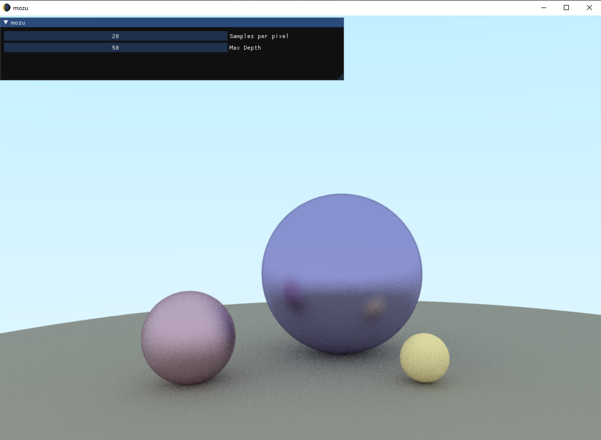
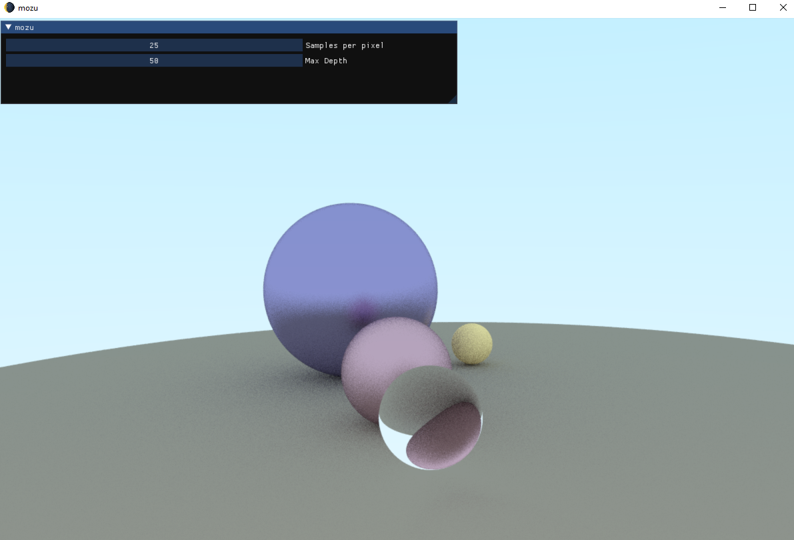
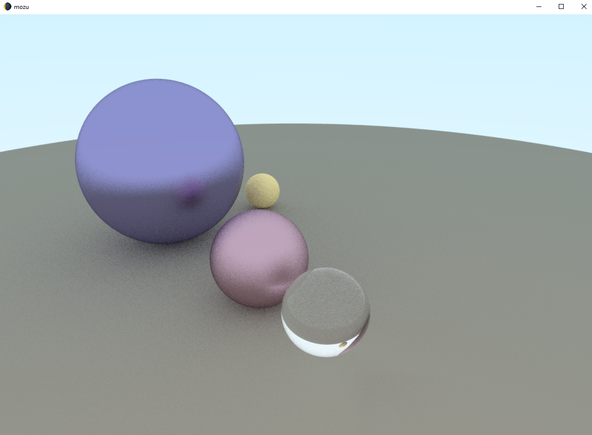
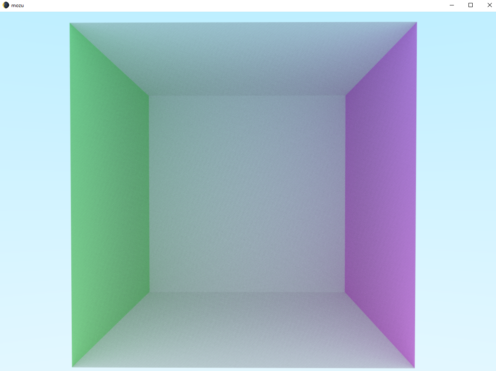
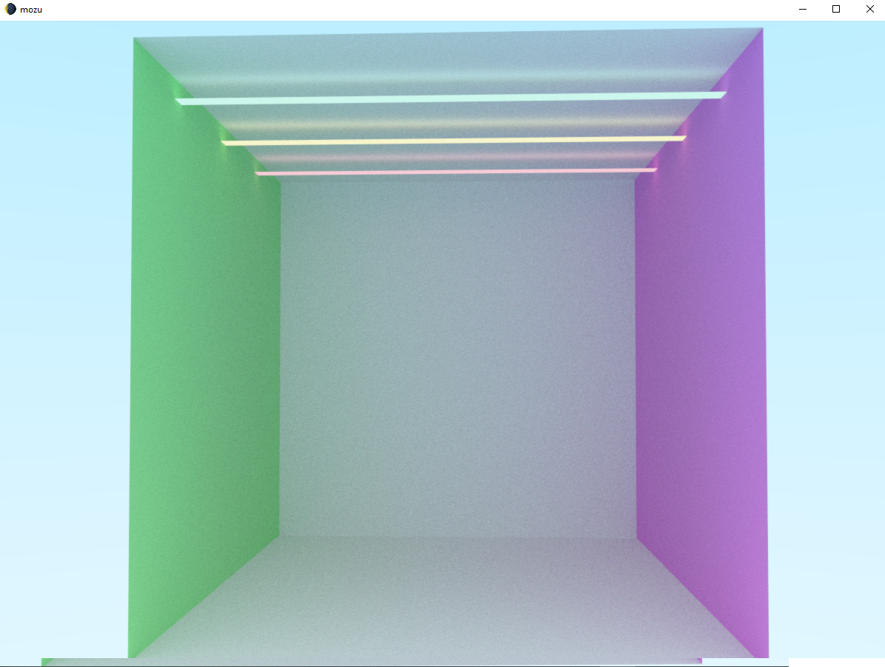
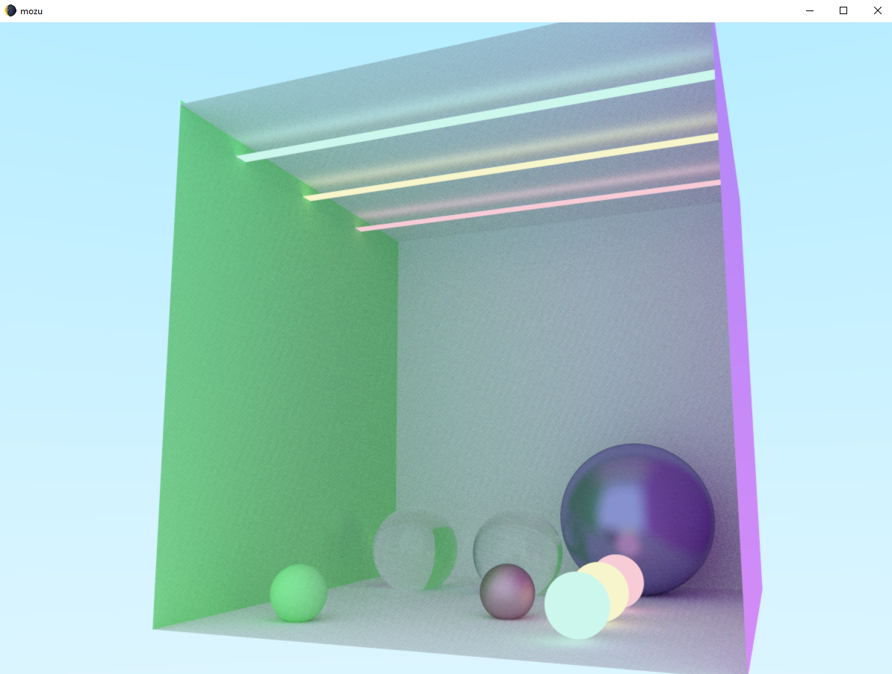
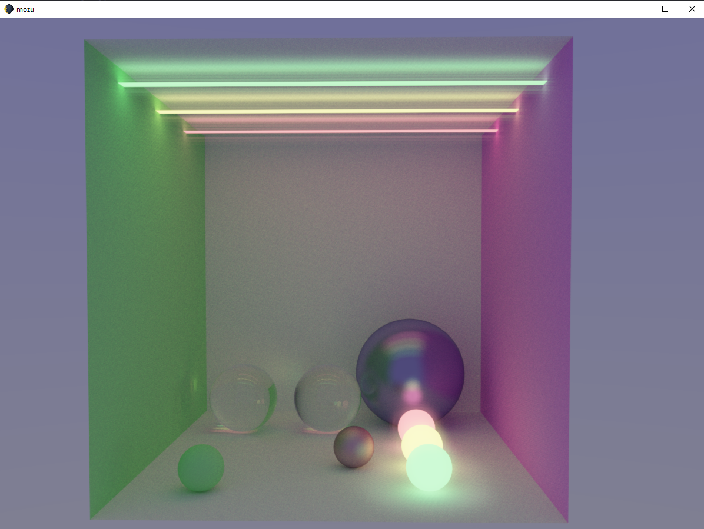

## 🏄🌒 mozu

OpenGL real-time ray tracer using Compute Shaders. Based on the "Ray Tracing in One Weekend series".

### 📷Progress:

#### Sky color & sphere hit

> Normalizing the y coordinate and interpolating between two colors. Checking if the rays hit the sphere and displaying the color.

#### Adding the ground sphere

#### Computing rays for a matte material - Lambertian

> Computed the resulting color by picking a random point inside a unit radius sphere, whose normal starts from the initial ray hit point. This is done recursively until a ray doesn't hit anything or a maximum depth is reached.

> True Lambertian distribution, achieved by picking random points in the sphere and then normalizing them.
> 
> Shadows are less pronounced and spheres are lighter.

> True Lambertian with 20 samples per pixel.
#### Computing rays for a metallic material 

> For metallic surfaces,rays aren't randomly scattered. Luckily, GLSL has the reflect function which returns the reflected ray. Randomizing the reflected ray by choosing a random endpoint as we did for the matte surface, we can get more rough (fuzzy) surfaces.

#### Computing rays for a glass material - Dielectric

>For a dielectric surface, a ray is split into both a reflected one and a refracted one. Assuming that all rays are only refracted we get this result.

>Using Schlick's polynomial aproximation we can determine if rays must pe reflected instead of refracted, giving the final result.

#### Cornell Box

>Added axis-aligned rectangles to make the Cornell box.

#### Emissive Material

>To make things more realistic, I added an emissive material for some ceiling lights & spheres. Rays hitting an emissive surface won't scatter so they retain their true albedo color output.

#### Scene Layout

>👌

#### Adding HDR & Bloom

> On the Post Processing layer, I added HDR, so the emissive material pops out more. I also added Bloom, which basically renders our lights as blurred (using Gaussian Blur), and adds the result on top of the base color.

### 🎥Video:

https://user-images.githubusercontent.com/51471463/166912693-68e48790-9b11-47f7-87da-3dccb1fc8c83.mp4

### More Renders

### 📚Resources:

[Ray Tracing in One Weekend](https://raytracing.github.io/)
